# 🧠 ResearchMind AI — Full Technical Document

> **Problem Statement · Solution Architecture · End-to-End Lifecycle**

---

## Table of Contents

1. [Problem Statement](#1-problem-statement)
2. [Solution Overview](#2-solution-overview)
3. [Technology Stack](#3-technology-stack)
4. [System Architecture](#4-system-architecture)
5. [Service Layer Deep-Dive](#5-service-layer-deep-dive)
6. [Full API Surface](#6-full-api-surface)
7. [End-to-End Lifecycle](#7-end-to-end-lifecycle)
8. [Security Threat Model](#8-security-threat-model)
9. [Production Readiness](#9-production-readiness)
10. [AWS Deployment Architecture](#10-aws-deployment-architecture)
11. [CI/CD Pipeline](#11-cicd-pipeline)
12. [Known Limitations & Roadmap](#12-known-limitations--roadmap)

---

## 1. Problem Statement

### The Research Reading Crisis

Researchers, students, and professionals routinely deal with hundreds of academic papers. Each paper is typically 8–30 dense pages of domain-specific content. The core problems:

| Pain Point | Reality |
|---|---|
| **Volume** | Thousands of papers published daily on arXiv alone |
| **Time** | Average paper takes 2–5 hours to fully absorb |
| **Cross-paper analysis** | Manual comparison across 5+ papers takes days |
| **Citation formatting** | Tedious, error-prone, style-guide-dependent |
| **Context loss** | Hard to remember insights from papers read weeks ago |
| **No interaction** | PDFs are static — you cannot ask them questions |

### What Doesn't Exist (Gap)

Existing tools are either:
- **Too generic** — ChatGPT doesn't know your specific uploaded papers
- **Too narrow** — citation managers don't answer questions
- **Too expensive** — enterprise research platforms cost thousands per month
- **Hallucination-prone** — general LLMs make up facts not in the paper

### The Core Requirement

A system that can:
1. **Ingest** any PDF research paper
2. **Understand** its content at a semantic level, not just keyword search
3. **Answer questions** grounded exclusively in the uploaded documents
4. **Compare** multiple papers across structured dimensions
5. **Generate citations** in all academic formats
6. **Export** analysis in any format
7. **Remember** conversation context across sessions

---

## 2. Solution Overview

**ResearchMind AI** is a full-stack, AI-powered research assistant built on a **Retrieval-Augmented Generation (RAG)** architecture. It bridges the gap between static PDF documents and conversational AI.

### RAG Core Concept

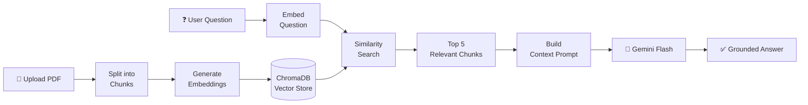

### Feature Set

| Feature | Description | Powered By |
|---|---|---|
| PDF Upload & Indexing | Upload, extract, chunk, embed | PyMuPDF + LangChain + Gemini Embeddings |
| AI Chat | Natural language Q&A over papers | RAG + Gemini Flash |
| Paper Comparison | Structured multi-paper analysis | Gemini Flash + ChromaDB |
| Citation Generator | APA, MLA, IEEE, Chicago, Harvard, BibTeX | Gemini Flash |
| Semantic Search | Meaning-based document search | ChromaDB Vector Search |
| Export | PDF, Word, Markdown, HTML, CSV, JSON, TXT | PyMuPDF, python-docx |
| Chat History | Persistent sessions with memory | JSON file storage |
| Dashboard | Real-time stats and analytics | FastAPI + Next.js |

---

## 3. Technology Stack

### Stack Overview

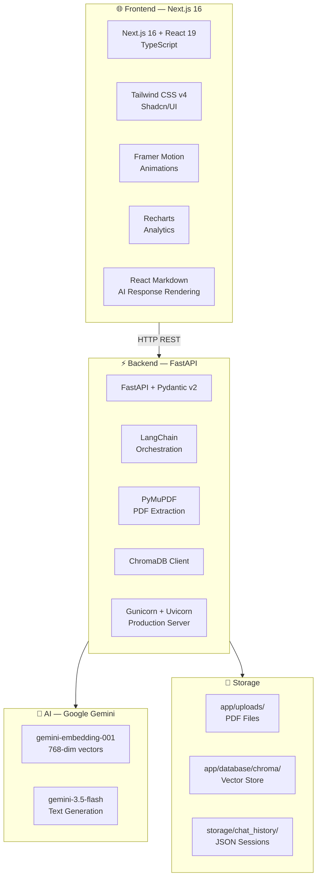

---

## 4. System Architecture

### High-Level System Map

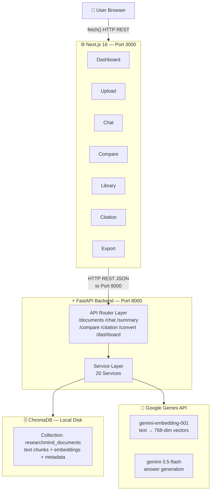

### File System Layout

```
ResearchMindAI/
├── backend/
│   ├── app/
│   │   ├── uploads/               ← Raw PDFs stored with UUID names
│   │   │   └── a3f8d2c1...pdf
│   │   ├── database/
│   │   │   └── chroma/            ← ChromaDB persistent store
│   │   │       └── chroma.sqlite3
│   │   ├── api/routes/            ← FastAPI route handlers (11 files)
│   │   ├── services/              ← Business logic (20 services)
│   │   ├── core/                  ← Config, logger, LLM initialisation
│   │   ├── rag/                   ← Vector store client
│   │   ├── schemas/               ← Pydantic request/response models
│   │   └── utils/                 ← Export format utilities
│   └── storage/
│       └── chat_history/          ← JSON chat session files
│           └── {uuid}.json
└── frontend/
    └── src/
        ├── app/                   ← Next.js App Router pages
        └── components/            ← Reusable React components
```

---

## 5. Service Layer Deep-Dive

### 5.1 PDF Ingestion Pipeline

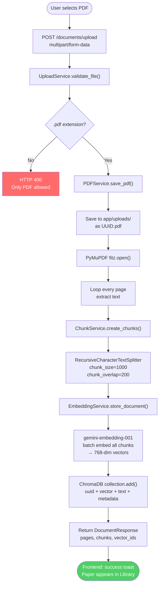

### 5.2 RAG Query Pipeline

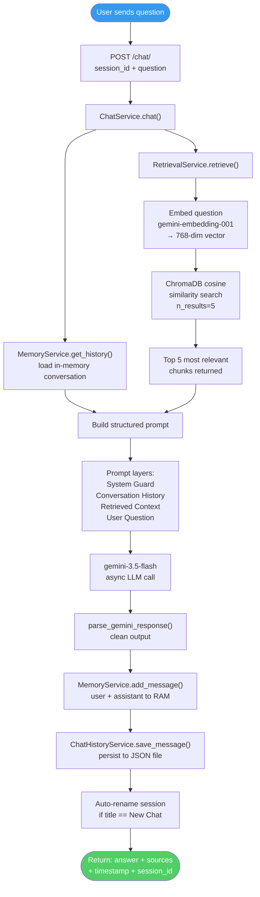

### 5.3 Summary Pipeline

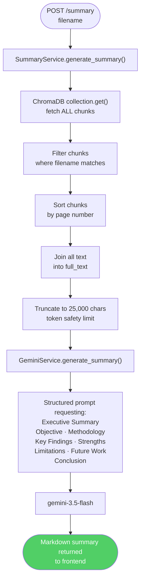

### 5.4 Comparison Pipeline

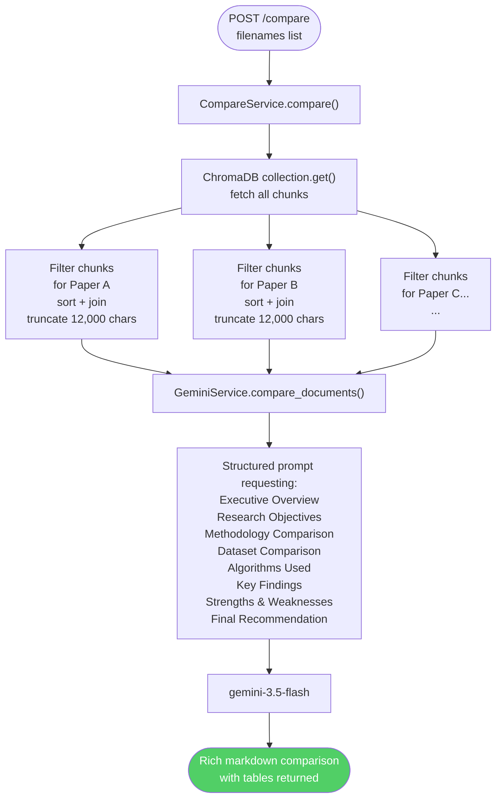

### 5.5 Citation Pipeline

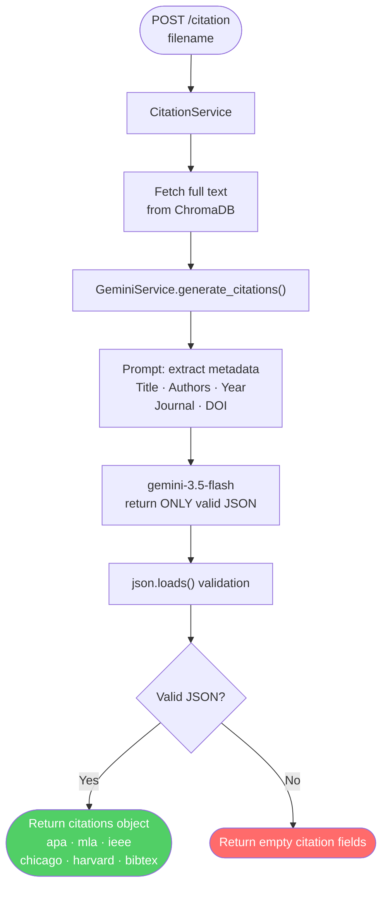

### 5.6 Export/Converter Pipeline

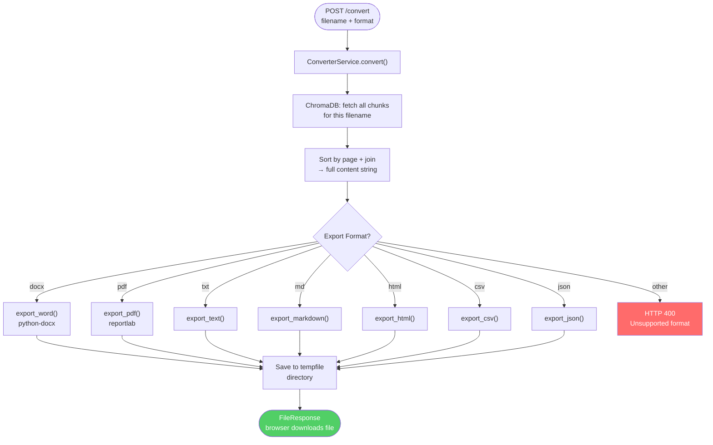

### 5.7 Chat Memory Architecture

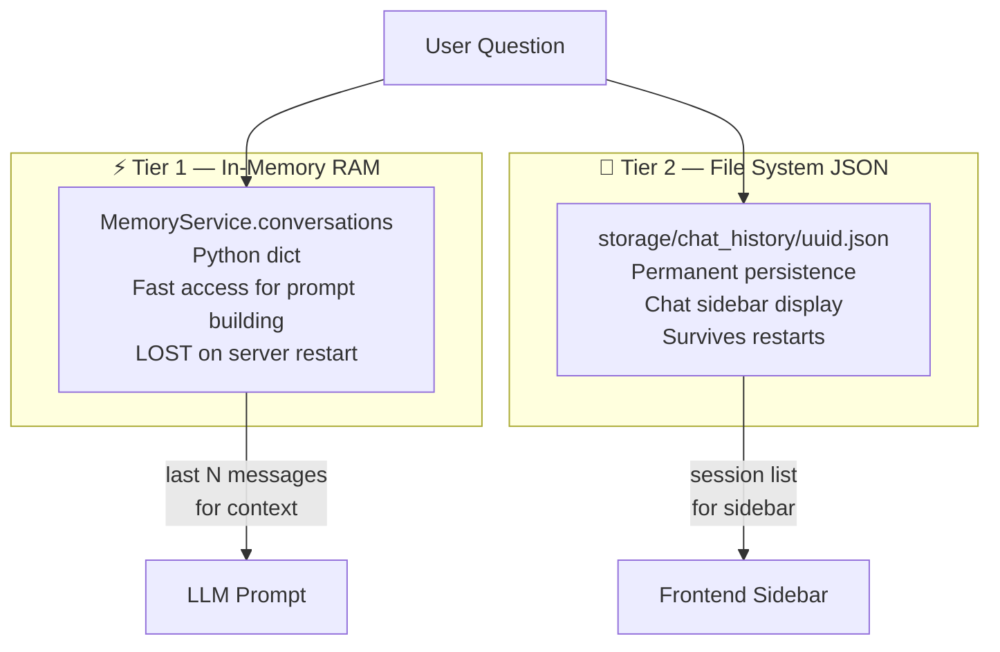

---

## 6. Full API Surface

| Method | Endpoint | Description | Input | Output |
|---|---|---|---|---|
| `POST` | `/documents/upload` | Upload & index PDF | `multipart/form-data` | `DocumentResponse` |
| `GET` | `/documents` | List all documents | — | `{documents}` |
| `GET` | `/documents/search/{query}` | Keyword search | URL param | `{documents}` |
| `GET` | `/documents/semantic-search/{query}` | Vector search | URL param | `{documents}` |
| `DELETE` | `/documents/{filename}` | Delete document | URL param | `{success}` |
| `GET` | `/documents/view/{filename}` | View PDF inline | URL param | `FileResponse` |
| `GET` | `/documents/download/{filename}` | Download PDF | URL param | `FileResponse` |
| `POST` | `/chat/new` | Create chat session | — | `{session}` |
| `POST` | `/chat/` | Send message, get AI answer | `{session_id, question}` | `{answer, sources}` |
| `GET` | `/chat/sessions` | List all sessions | — | `{sessions}` |
| `GET` | `/chat/{session_id}` | Load a session | URL param | `{session}` |
| `DELETE` | `/chat/{session_id}` | Delete session | URL param | `{success}` |
| `PUT` | `/chat/{session_id}/rename` | Rename session | Query param | `{success}` |
| `POST` | `/summary` | Generate paper summary | `{filename}` | `{summary}` |
| `POST` | `/compare` | Compare multiple papers | `{filenames[]}` | `{comparison}` |
| `POST` | `/citation` | Generate citations | `{filename}` | `{apa, ieee, ...}` |
| `POST` | `/convert` | Export document | `{filename, format}` | `FileResponse` |
| `GET` | `/export/` | Export report | varies | `FileResponse` |
| `GET` | `/dashboard` | Get usage stats | — | `{papers, pages, chunks}` |
| `GET` | `/health` | Health check | — | `{status}` |

---

## 7. End-to-End Lifecycle

### Lifecycle A — Document Upload

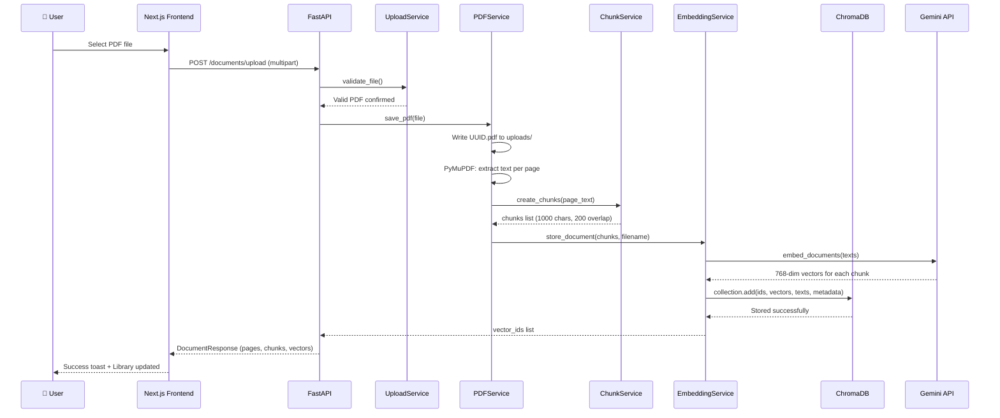

### Lifecycle B — AI Chat Question

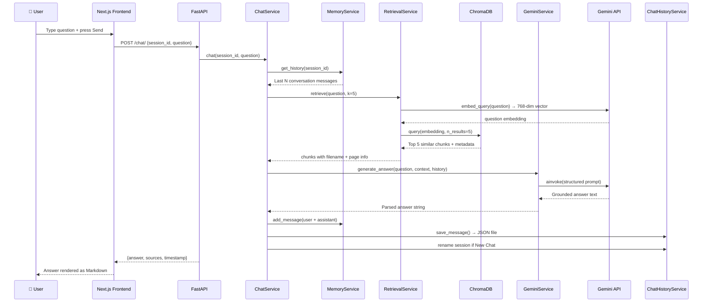

### Lifecycle C — Paper Comparison

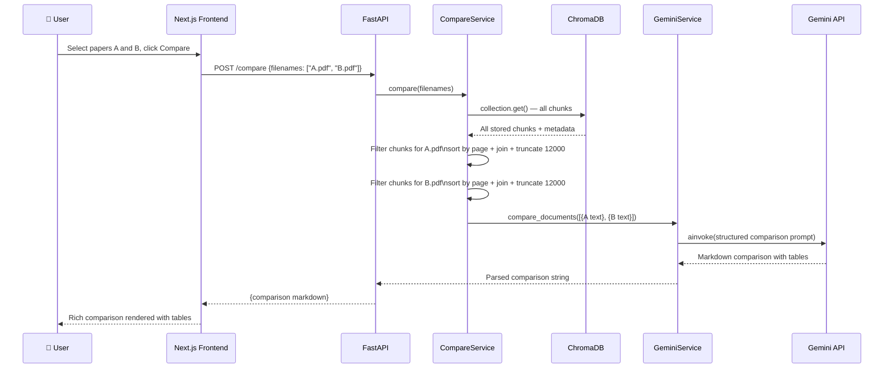

---

## 8. Security Threat Model

### Attack Surface Map

```mermaid
graph TD
    ATK["🔴 External Attacker"]

    ATK --> T1["Prompt Injection\nvia Chat Question\nForget everything..."]
    ATK --> T2["API Abuse\nNo Authentication\nAnyone can call any endpoint"]
    ATK --> T3["Upload Bomb\n5GB file accepted\nServer OOM crash"]
    ATK --> T4["Error Reconnaissance\nstr(e) sent to client\nLeaks paths + versions"]
    ATK --> T5["Memory Exhaustion\nUnbounded chat history\nRAM grows forever"]
    ATK --> T6["API Key Theft\n.env in git history\nInstant quota drain"]
    ATK --> T7["Filename Injection\nIgnore above dot pdf\nInjected into LLM prompt"]
    ATK --> T8["Rate Limit Abuse\n1000 chat calls/min\nGemini bill explosion"]

    T1 --> S1["FIX: System guard prompt\n+ injection regex filter\n+ input length cap"]
    T2 --> S2["FIX: API key header auth\non all FastAPI routers"]
    T3 --> S3["FIX: Enforce MAX_FILE_SIZE\nbefore disk write"]
    T4 --> S4["FIX: Generic error messages\nlog full details server-side"]
    T5 --> S5["FIX: Cap history to\nlast 20 messages"]
    T6 --> S6["FIX: Add .env to .gitignore\nRotate compromised keys\nUse AWS Secrets Manager"]
    T7 --> S7["FIX: sanitize_for_prompt()\nstrip special chars\nlimit to 200 chars"]
    T8 --> S8["FIX: slowapi rate limiter\n10/min chat, 5/min upload"]

    style ATK fill:#ff0000,color:#fff
    style T1 fill:#ff6b6b,color:#fff
    style T2 fill:#ff6b6b,color:#fff
    style T3 fill:#ff9f43,color:#fff
    style T4 fill:#ff9f43,color:#fff
    style T5 fill:#ff9f43,color:#fff
    style T6 fill:#ffd43b
    style T7 fill:#ffd43b
    style T8 fill:#ffd43b
    style S1 fill:#51cf66,color:#fff
    style S2 fill:#51cf66,color:#fff
    style S3 fill:#51cf66,color:#fff
    style S4 fill:#51cf66,color:#fff
    style S5 fill:#51cf66,color:#fff
    style S6 fill:#51cf66,color:#fff
    style S7 fill:#51cf66,color:#fff
    style S8 fill:#51cf66,color:#fff
```

### Security Fix Priority Table

| Priority | Issue | File to Change |
|---|---|---|
| 🔴 Critical | Prompt injection / LLM jailbreak | `gemini_service.py` |
| 🔴 Critical | No API authentication | All routers + new `security.py` |
| 🟠 High | File size not enforced | `upload_service.py` |
| 🟠 High | Error details leaked to client | All route files |
| 🟠 High | Unbounded memory growth | `memory_service.py` |
| 🟠 High | Filename injected into prompts | `gemini_service.py`, `compare_service.py` |
| 🟡 Medium | No rate limiting | `main.py` + AI routes |
| 🟡 Medium | `.env` commit risk | `.gitignore` + git audit |
| 🟡 Medium | CORS — never use wildcard | `main.py` |

---

## 9. Production Readiness

### What Must Change Before Going Live

#### Replace All Hardcoded URLs (20 files affected)

```typescript
// 1. Create frontend/src/lib/api.ts
export const API_URL = process.env.NEXT_PUBLIC_API_URL ?? "http://127.0.0.1:8000";

// 2. Replace every instance of:
fetch("http://127.0.0.1:8000/...")

// 3. With:
import { API_URL } from "@/lib/api";
fetch(`${API_URL}/...`)
```

#### Environment Files

```bash
# frontend/.env.local  (npm run dev)
NEXT_PUBLIC_API_URL=http://127.0.0.1:8000

# frontend/.env.production  (npm run build)
NEXT_PUBLIC_API_URL=https://api.yourdomain.com

# backend/.env  (production)
GOOGLE_API_KEY=<from AWS Secrets Manager>
API_SECRET_KEY=<openssl rand -hex 32>
ALLOWED_ORIGINS=https://yourdomain.com,https://www.yourdomain.com
```

#### Production Server Command

```bash
# Development (single-threaded, auto-reload — NEVER use in prod)
uvicorn app.main:app --reload

# Production (multi-worker, stable)
gunicorn app.main:app \
  -k uvicorn.workers.UvicornWorker \
  --workers 4 \
  --bind 0.0.0.0:8000 \
  --timeout 120
```

#### Pre-Deploy Checklist

```
[ ] All hardcoded 127.0.0.1:8000 URLs replaced
[ ] NEXT_PUBLIC_API_URL set in deployment environment
[ ] CORS locked to production domain only
[ ] API authentication on all routes
[ ] Prompt injection guard implemented
[ ] Rate limiting on all AI endpoints
[ ] File size enforcement working
[ ] Error messages sanitized
[ ] Chat memory capped at 20 messages
[ ] .env NOT committed to git
[ ] Google API key rotated if ever exposed
[ ] next.config.ts output: "standalone" added
[ ] gunicorn in requirements.txt
[ ] Docker compose tested locally
[ ] HTTPS certificate provisioned
[ ] Health endpoint responding
[ ] ChromaDB persistence confirmed
```

---

## 10. AWS Deployment Architecture

### Recommended Architecture — EC2

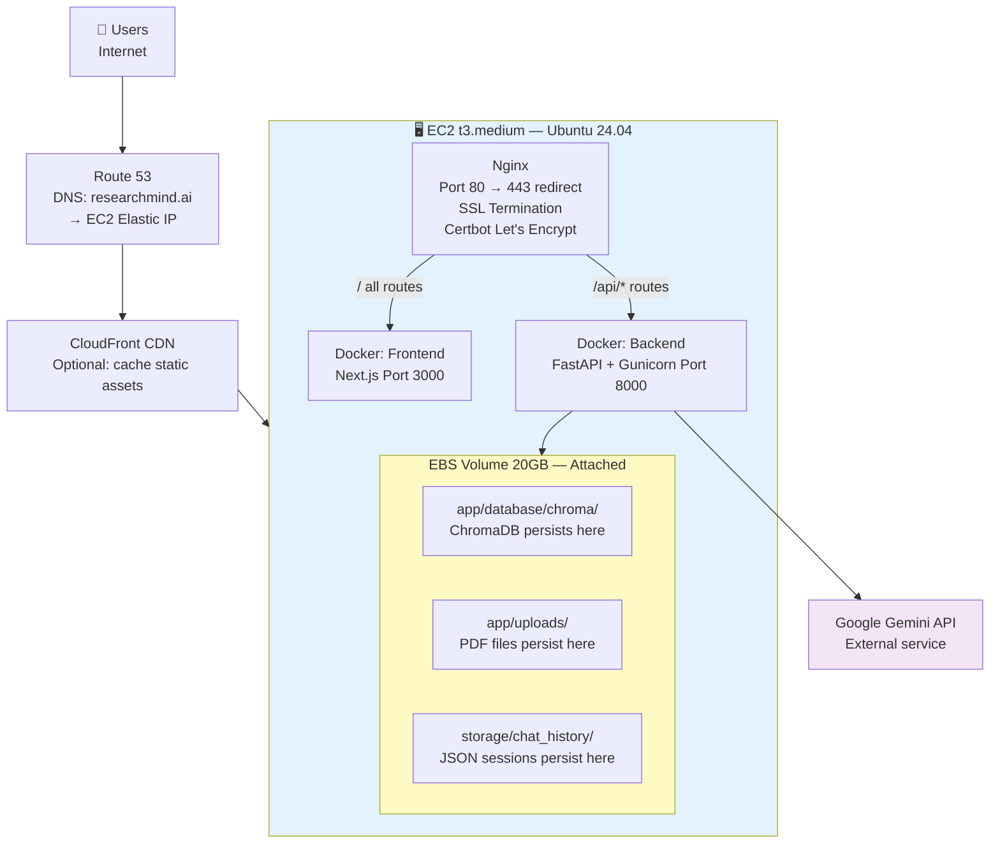

### AWS Service Comparison

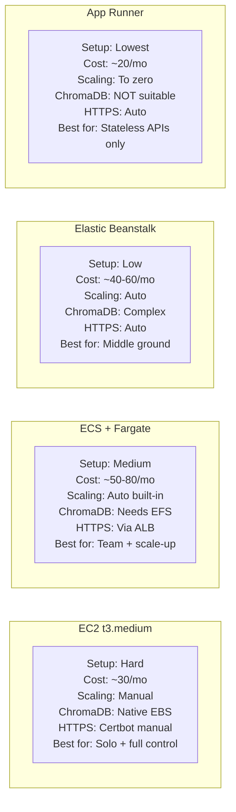

### Docker Compose — Production Stack

```yaml
version: "3.9"

services:
  backend:
    build: ./backend
    ports:
      - "8000:8000"
    env_file: ./backend/.env
    volumes:
      - chroma_data:/app/app/database/chroma
      - upload_data:/app/app/uploads
      - chat_data:/app/storage
    restart: unless-stopped

  frontend:
    build: ./frontend
    ports:
      - "3000:3000"
    environment:
      - NEXT_PUBLIC_API_URL=http://backend:8000
    depends_on:
      - backend
    restart: unless-stopped

volumes:
  chroma_data:
  upload_data:
  chat_data:
```

---

## 11. CI/CD Pipeline

### Deployment Flow

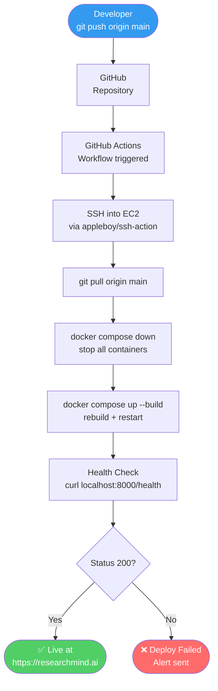

### GitHub Actions Workflow

```yaml
# .github/workflows/deploy.yml
name: Deploy ResearchMind AI

on:
  push:
    branches: [main]

jobs:
  deploy:
    runs-on: ubuntu-latest
    steps:
      - uses: actions/checkout@v4

      - name: Deploy to EC2
        uses: appleboy/ssh-action@v1
        with:
          host: ${{ secrets.EC2_HOST }}
          username: ubuntu
          key: ${{ secrets.EC2_SSH_KEY }}
          timeout: 300s
          script: |
            cd /home/ubuntu/ResearchMindAI
            git pull origin main
            docker compose down
            docker compose up -d --build
            sleep 10
            curl -f http://localhost:8000/health || exit 1
            echo "Deploy successful"
```

---

## 12. Known Limitations & Roadmap

### Current Technical Debt

| Limitation | Severity | Impact | Fix |
|---|---|---|---|
| No authentication | High | Single-user, no isolation | Clerk / Auth0 |
| ChromaDB on local disk | High | Lost on container restart | EFS or Pinecone |
| Chat memory in RAM | Medium | Lost on server restart | Redis |
| Chat history in JSON | Medium | Doesn't scale past ~10k sessions | PostgreSQL |
| File size not enforced | High | OOM / DoS risk | Fix in upload_service.py |
| No rate limiting | High | Gemini bill explosion | slowapi |
| No response streaming | Low | AI feels slow | Server-Sent Events |
| Single-tenant design | Medium | All users share document pool | Add user_id scoping |

### Version Roadmap

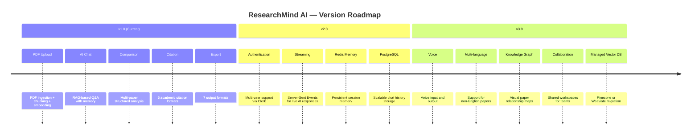

---

## Summary

ResearchMind AI is a complete RAG-based research assistant built with:

- **7-step document ingestion** — upload → validate → extract → chunk → embed → store → index
- **7-step RAG query** — receive → load memory → embed question → retrieve chunks → build prompt → generate → persist
- **10 distinct API feature areas** across 20+ endpoints
- **Dual-tier memory** — RAM for speed, JSON for persistence
- **7 export formats** — PDF, Word, Markdown, HTML, CSV, JSON, TXT
- **10 security vulnerabilities identified** — all with specific implementable fixes
- **Production path** — EC2 + Docker + Nginx + Certbot + GitHub Actions CI/CD

The architecture is intentionally modular — each of the 20 services is independent, making it straightforward to swap components: ChromaDB → Pinecone, Gemini → OpenAI, JSON history → PostgreSQL, without restructuring the system.
